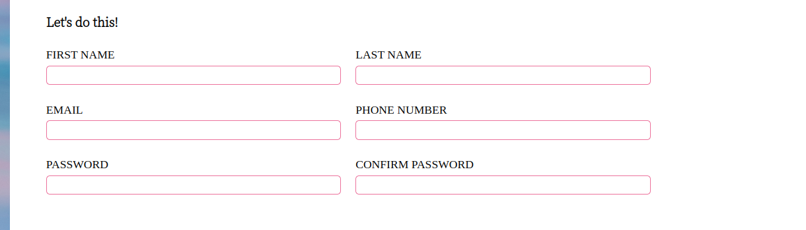

# **Sign Up Form**

## **Introduction**

In this project I built a sign-up form to collect user information using HTML form controls. In addition to this, I used different client side form validations to make sure users entered the correct data before it is sent to the backend.

The full implementation of the project can be found [here](https://wilsonsiaw.github.io/sign-up-form/).

## **Technologies Used**

## **Features**

There are a couple of features in this project I would like to highlight.

The first feature I would like to highlight is the form controls used to collect user data. These consist of the users first name, last name, email address, phone number, password and password confirmation field.

