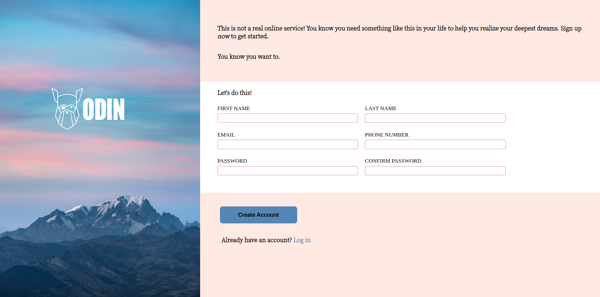
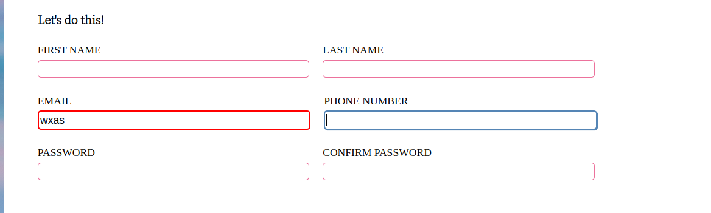

# **Sign Up Form**

## **Introduction**

In this project I built a sign-up form to collect user information using HTML form controls. In addition to this, I used different client side form validations to make sure users entered the correct data before it is sent to the backend.

The full implementation of the project can be found [here](https://wilsonsiaw.github.io/sign-up-form/).

## **Technologies Used**

## **Features**

The first feature I would like to highlight is the form controls used to collect user data. These consist of the users first name, last name, email address, phone number, password and password confirmation fields.

Another feature I implemented related to the form controls, is what happens when each field receives focus. The fields that receive focus change color to make the form more user friendly.

In addition this, the form fields are validated when the user enters invalid information. The example below shows what happens when the user enters an invalid email address into the email field.

As can be seen above, the email field border changes to red to let the user know the data entered is invalid.

The final feature I would like to mention is the submit button. The button changes color when a user hovers over it. Again this was done to improve user interaction with the form.

## **What I Learned**

In this project, I learned how to create HTML forms using different HTML form controls. In addition to this I learned how to create client-side form validations using just HTML and CSS. 

I also learned how to create different types of user interactions using CSS pseudo-classes. For example, to create invalid form validations, I used the :invalid pseudo-class. 

Beyond these things, I continued to learn how to style and position HTML elements using CSS.

## **Challenges**

The biggest challenge I faced in doing this project was overlaying an image over another image. In this case, the logo had to be overlayed over the main background image. I was finally able to do this using the CSS Position property on both the background image and the logo itself.

